<!--
  github.com/antonsoo  ·  profile README
  The banner, the cards, and the ledger are generated by code in this repo
  (see /scripts); text is baked to vector paths, so the Greek (and the Hebrew,
  and the Gothic) renders identically everywhere. Curiosity is welcome.
-->

 

By training, an AI researcher; by calling, a teacher of very old languages: eleven so far, from Latin and Ancient Greek to Gothic and Classical Chinese, all spoken out loud.

## Dē mē &nbsp;·&nbsp; about

- Founder & CEO of **[PRAVIEL](https://praviel.com)**, a lessons-first app that teaches ancient languages as living, speakable systems.
- Trained in **artificial intelligence** at the Institute of Science Tokyo. Before PRAVIEL: speech recognition on supercomputers, LLM agents, and a startup or two.
- I care about pronunciation, provenance, and shipping. Order depends on the day.
- My bio reads **ΓΝΩΘΙ ΣΑΥΤΟΝ**, *know thyself*. Thales called it the hardest thing there is; the easiest, advising others (Diogenes Laertius 1.36).

## Opera &nbsp;·&nbsp; what I am building

<table>
<tr>
<td width="150" align="center" valign="middle">
  
</td>
<td valign="middle">

**PRAVIEL: Ancient Languages.** Duolingo proved that five minutes a day can carry a language; PRAVIEL points that habit at Latin, Ancient Greek, and nine other ancient tongues, and holds it to a scholar's standard. Short daily lessons in speaking, listening, and reading, with reconstructed pronunciation you can actually hear. Hold a conversation with a historical persona, or tap any word of a real text to take it apart. Built for beginners, checked by experts. Free to start, on web, iPhone, and Android.

</td>
</tr>
</table>

Under the hood: one <strong>Flutter and Dart</strong> codebase carries the app to iPhone, Android, and the web; the marketing site is <strong>Next.js on Node</strong> at praviel.com; the AI tutors keep their sources in order. The languages remain the hard part.

**From the workshop.** A few public pieces from the machine-learning years:

| Repository | What it is |
| :-- | :-- |
| [pneumonia-detection-xray-resnet](https://github.com/antonsoo/pneumonia-detection-xray-resnet) | A ResNet that reads chest X-rays for signs of pneumonia. |
| [TS-VAD](https://github.com/antonsoo/TS-VAD) | Target-speaker voice activity detection: who is speaking, and exactly when. |
| [LLM-Powered-Text-Enhancement-Suite](https://github.com/antonsoo/LLM-Powered-Text-Enhancement-Suite) | An LLM toolchain for rewriting, correcting, and sharpening prose. |
| [customer-churn-prediction-streamlit](https://github.com/antonsoo/customer-churn-prediction-streamlit) | Predicting who is about to leave, while there is still time to ask them to stay. |
| [codegen-llm](https://github.com/antonsoo/codegen-llm) | Experiments in teaching models to write code worth keeping. |

Every script baked to vector paths: the Arabic joins, the Sanskrit ligates, the Hebrew runs right to left. Egyptian hieroglyphs live in the app.

  

The first row's adjective is Pliny's: he files Archimedes under <em>machinalis scientia</em> (Natural History 7.125).

  

A new line each morning, by GitHub Action, from people considerably wiser than me.

  

GitHub sees only my open half; the busiest repositories are private. Roman numerals make any figure look deliberate.

  

<picture>
  <source media="(prefers-color-scheme: dark)" srcset="https://raw.githubusercontent.com/antonsoo/antonsoo/output/snake-dark.svg" />
  
</picture>

A serpent once grazed the offerings at Anchises' tomb, and Aeneas wondered if it was the spirit of the place (Aeneid 5.84-96). This one grazes on commits.

## Sēmina &nbsp;·&nbsp; seeds

Two ideas sit in the drawer and receive the occasional weekend visit: a proper **game for learning ancient languages**, with a world in it rather than flashcards with confetti, and an app that finally teaches **music theory** the way theory deserves. PRAVIEL holds the floor until further notice. Good seeds keep.

## Vincula &nbsp;·&nbsp; the links

 

The banner, the cards, and the ledger were drawn by code in <a href="https://github.com/antonsoo/antonsoo/tree/main/scripts">/scripts</a>. Yes, even the Greek, the Hebrew, and the Gothic. <strong>Manū propriā.</strong>

